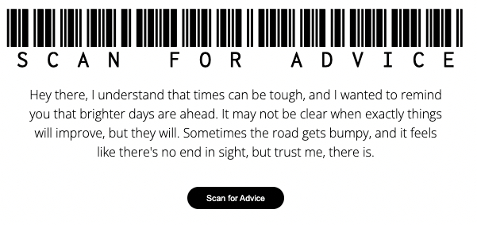

# Scan For Advice
After completing a full-stack boot camp, I found myself struggling with the next steps. I often felt lost when it came to searching for a job, figuring out how to continue learning, and determining whether I was truly prepared for a developer position.

Through this small frontend project, my aim is to offer a moment to pause and take a breath. By simply `scanning`, you will receive random life advice.

Remember, life is both too short and very long. Try to cherish the little moments.

## Project Setup
To start the project locally: 

1. Open a terminal in VS Code
2. Type `cd Feel_better`
3. Type `yarn install`

Use `yarn dev` to start the  dev environment.

### Api Used

For this project, I used [Advice Slip Json Api](https://api.adviceslip.com/?ref=apilist.fun#top)

### Tech Used

